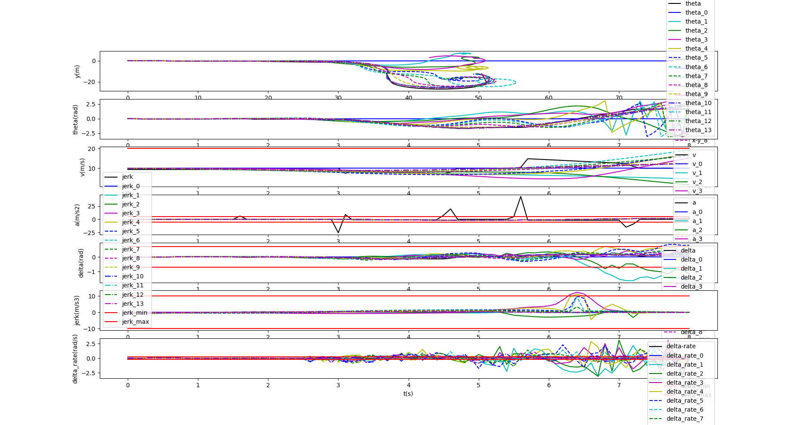

# Trajectory Planner ROS Package

C++/ROS Source Codes for Trajectory planning for autonomous driving using ilqr solver.


## 1. Installation

Requirements

* ROS Melodic or later
* Python3

Clone repository to any catkin workspace and compile workspace

```shell
cd ~/catkin_ws/src
git clone https://github.com/mpt0816/Cilqr.git
cd ..
catkin_make
source devel/setup.bash
```
## 2. Example

https://github.com/mpt0816/Cilqr/blob/master/resources/demo.webm

### 2.1 Costs of iterations


### 2.2 Trajectory of iterations


### 2.3 Final Trajectory


## 3. Run
Example test case with 6 pedestrians, 3 moving vehicles and 2 static vehicles.

```shell
roslaunch planning pedestrian_test.launch
```

or
```shell
cd ~/catkin_ws/src
bash src/Cilqr/scripts/run.sh
```

**Click anywhere in Rviz window with the `2D Nav Goal` Tool to start planning.**

Generate and run new random case:

```shell
roslaunch planning random_pedestrian_test.launch
```

- Red Trajectory: Coarse Trajectory from DP Planner;
- Yellow Trajectory: Init guess Trajectory from Cilqr, whilch just got straight line;
- Green Trajectory: Final Trajectory from Cilqr;

If you want to get a better result, use the `Tracker` to get the initial guess.

```cpp
  // in src/Cilqr/algorithm/ilqr_optimizer.cpp , line 168 ~ 169
  // InitGuess(coarse_traj, &states, &controls);
  OpenLoopRollout(coarse_traj, &states, &controls);
```

## 4. Acknowledgement
Special thanks to [Bai Li](https://github.com/libai1943/CartesianPlanner) for ros simulation environment and [Galaxy](https://github.com/StarryN/Galaxy) for the safe corridor.

